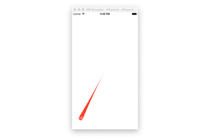
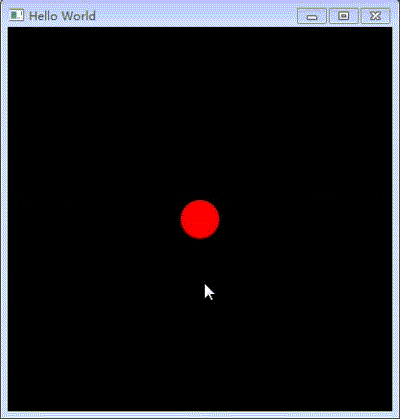

# 研究 qml 粘性控件的实现

Make some gooey effects component by QML Canvas. 

看来现在有两种实现机制，一种是使用 `Canvas`，另一种是使用 `GLSL`着色器实现。

本项目使用 `Canvas` 实现的粘性控件。

---

参考文档：

[实例详讲iOS实现QQ粘性动画效果](http://www.open-open.com/lib/view/open1435373283357.html)

[Creative Gooey Effects ](http://tympanus.net/codrops/2015/03/10/creative-gooey-effects/)